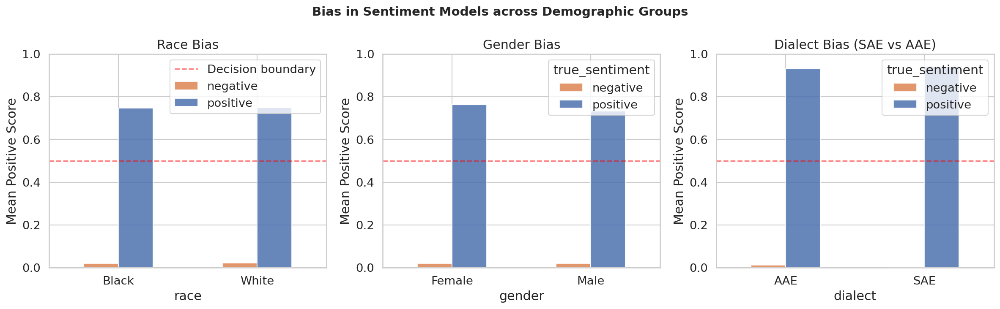

# Fairness in Sentiment Analysis — Do NLP Models Treat Everyone Equally?

**Author:** Krishna Varshini Ilindra  
**Background:** M.S. in Computer Science, University of Bridgeport, Software developer at a startup 
**Run the notebook:** [Open in Colab](https://colab.research.google.com/drive/1y3-6HhZEZoQvNnmmQk3p3DXUsx0_iVdu)

---

## Why I Built This

Sentiment analysis models are used everywhere — in hiring tools, 
healthcare platforms, and content moderation systems. But what happens 
when these models quietly treat certain groups of people differently?

I wanted to find out whether widely-used pre-trained models are actually 
fair, or whether they disadvantage certain groups without anyone noticing. 
This project measures that — using controlled experiments across race, 
gender, and dialect.

---

## What I Measured

I ran two well-known sentiment models on sentences that were identical 
in meaning but differed only in who they referred to — names associated 
with different racial groups, male vs female references, and the same 
sentences written in Standard American English vs African American English.

If the models score these sentences differently, that difference is bias.

**Models used:**
- `cardiffnlp/twitter-roberta-base-sentiment` — trained on 58M tweets
- `distilbert-base-uncased-finetuned-sst-2-english` — trained on movie reviews

**Datasets:**
- Equity Evaluation Corpus (EEC) — 4,096 controlled sentences
- Custom AAE vs SAE parallel sentence pairs

---

## What I Found

| Bias Dimension | Gap | What It Means |
|---|---|---|
| Race (White vs Black names) | 0.0024 | Negligible — model is largely fair on race |
| Gender (Female vs Male) | +0.0285 | Female-associated text consistently scores higher |
| Dialect (SAE vs AAE negatives) | 3× confidence gap | Model hesitates more on AAE text |

The most interesting finding was about dialect. The model classified 
both SAE and AAE sentences with 100% accuracy — but its confidence 
was measurably lower for negative AAE sentences. AAE negative text 
received a mean positive score of 0.0121, compared to just 0.0040 
for equivalent SAE text.

This kind of confidence gap might seem small — but in real-world 
applications, lower model confidence on minority dialect text can 
amplify into actual errors at scale.

---

## Results

---

## What Comes Next

This project is a starting point. The natural next steps are:
- Testing across a larger and more diverse set of AAE sentences
- Studying intersectional bias — what happens when race, gender, 
  and dialect overlap
- Exploring whether fairness-constrained fine-tuning can reduce 
  these gaps without hurting overall accuracy

---

## How to Run

1. Click **Open in Colab** above
2. Runtime → Change runtime type → T4 GPU
3. Run all cells from top to bottom — everything installs automatically

---

## References

- Kiritchenko & Mohammad (2018). Examining Gender and Race Bias 
  in Two Hundred Sentiment Analysis Systems. SemEval.
- Blodgett et al. (2016). Demographic Dialectal Variation 
  in Social Media. EMNLP.
- Agrawal et al. (2020). A Comprehensive Analysis of Preprocessing 
  for Word Representation Learning in Affective Tasks. ACL 2020.
